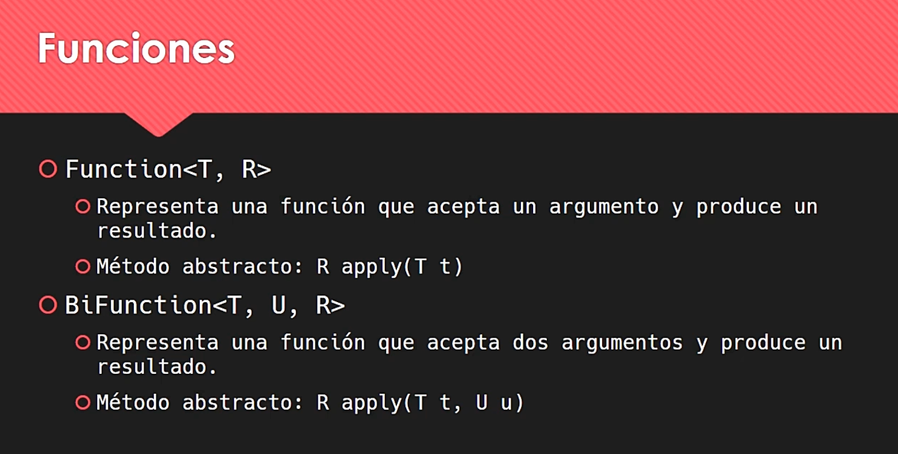
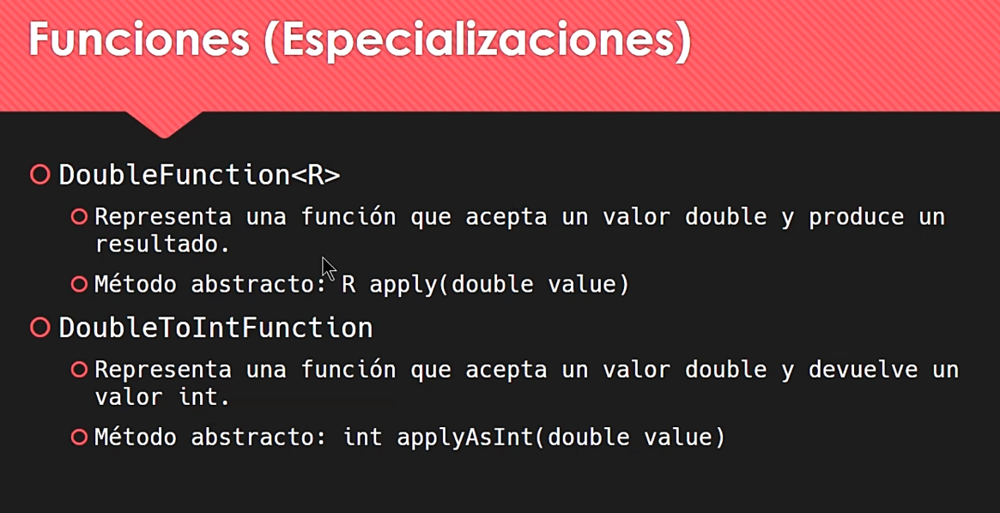
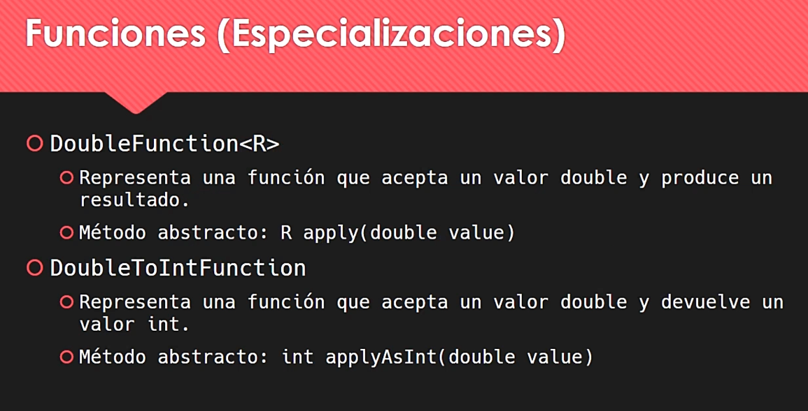

# Material de estudio programación funcional y de mas ...

## Descripción

Diferentes con tipos diferentes

Y continuan así...

Documentación de paquete.java.function

https://docs.oracle.com/javase/8/docs/api/java/util/function/package-summary.html

